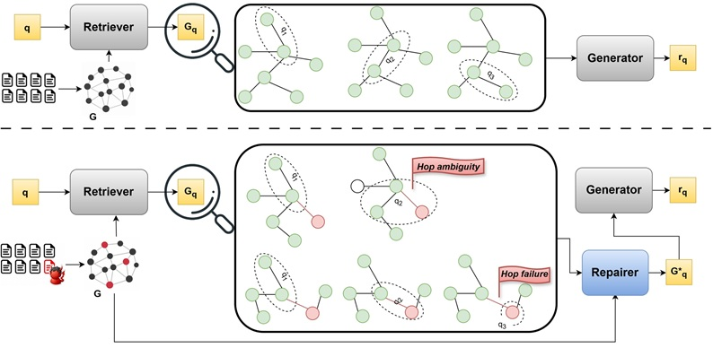

# Defense Against Knowledge Poisoning Attack on GraphRAG

## 🧠 Overview

This repository contains the code and experiments for a defense framework against knowledge poisoning attacks in GraphRAG-style multi-hop QA systems. Our method, HoG-GRAG (Hop-wise Guard for GraphRAG), improves robustness by decomposing multi-hop questions into ordered subqueries, detecting poisoning-induced inconsistencies during hop-wise execution, and repairing corrupted retrieved subgraphs through targeted pruning and minimal evidence recovery.



We evaluate this framework on multi-hop question answering using:

- **Datasets**
  - [MuSiQue](https://github.com/StonyBrookNLP/musique)
  - [HotpotQA](https://github.com/hotpotqa/hotpot)

- **GraphRAG Pipelines**
  - [Microsoft GraphRAG](https://github.com/microsoft/graphrag)
  - [LightRAG](https://github.com/HKUDS/LightRAG)


### 📂 Repository Structure

This repository is organized around the two core components of Auto-Immune GraphRAG — detection and repair — with supporting modules for evaluation.

```text
HoG-GRAG/
│        
├── prompts/ 
│   │   └── Question Paraphrasing.md
│   │   └── Response Evaluation.md
├── src/
│   ├── detection.py               
│   ├── repairer.py             
│   ├── repair_trace_analysis.py               
│   ├── evaluation.py
├── baselines/
│   │   └── Query_Paraphrasing.py
│   │   └── Perplexity_based.py
├── requirements.txt             
└── README.md
```

## 📄 Citation

If you use this methodology in your research, please cite:

> Havva Alizadeh Noughabi, Fattane Zarrinkalam, Ali Dehghantanha, **Defense Against Knowledge Poisoning Attack on GraphRAG**, Accepted at the Annual Meeting of the Association for Computational Linguistics (ACL 2026)  
